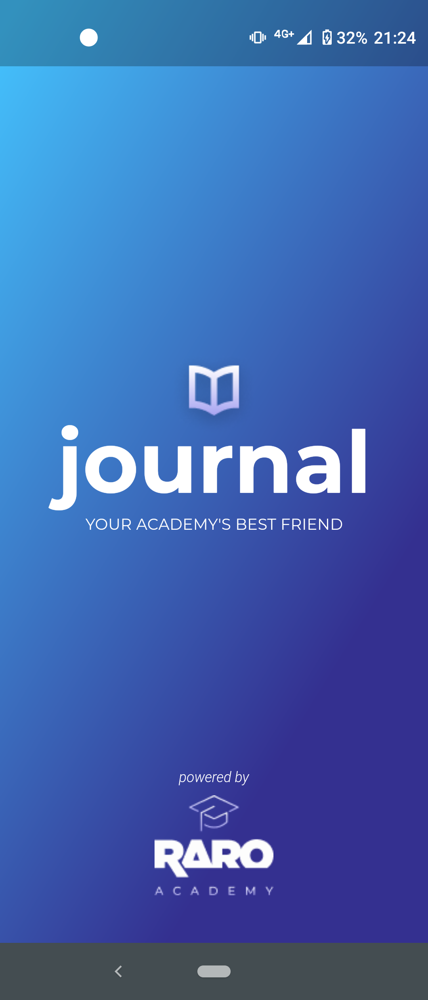
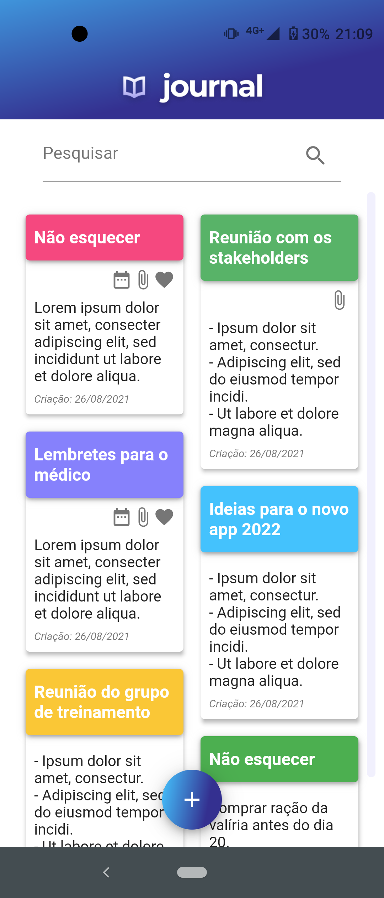

# #LevelUP4 | Raro Academy  
  
## Journal  
Notes app built with Flutter in the Raro Academy Training.  

## Result  

  
  
  

  

## Screens  
- Splash Screen
- Homepage with 'Add New Note' Button (mocked notes) and search field (not working)
- New Note after click on Add New Note button or when click on any note on the screen

## Dependencies
- animated_card
- flutter_staggered_grid_view
  